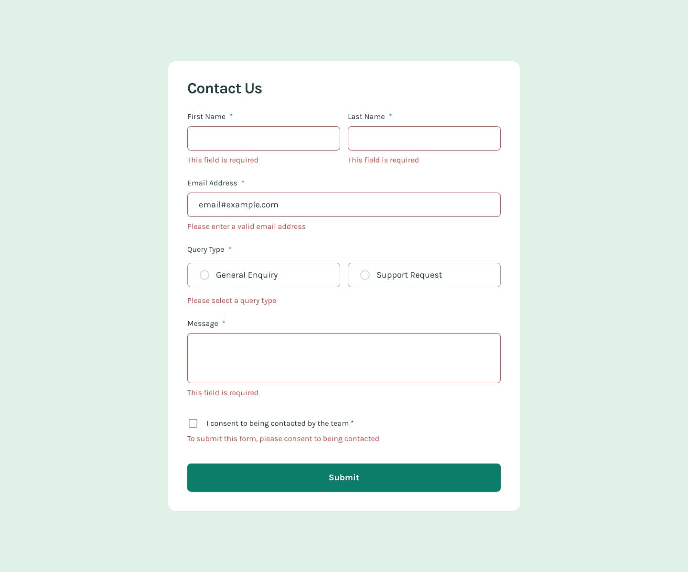

# Frontend Mentor - Contact Form Solution 🚀

This is a solution to the [Contact form challenge on Frontend Mentor](https://www.frontendmentor.io/challenges/contact-form--G-hYlqKJj). Frontend Mentor challenges help you improve your coding skills by building realistic projects.

## Table of Contents 📑

- [Overview](#overview)
  - [The Challenge](#the-challenge)
  - [Screenshot](#screenshot)
  - [Links](#links)
- [My Process](#my-process)
  - [Built With](#built-with)
  - [What I Learned](#what-i-learned)
  - [Continued Development](#continued-development)
  - [Useful Resources](#useful-resources)
- [Author](#author)
- [Acknowledgments](#acknowledgments)

## Overview 🌟

### The Challenge

Users should be able to:

- ✅ Complete the form and see a success toast message upon successful submission
- ✅ Receive form validation messages if:
  - A required field has been missed
  - The email address is not formatted correctly
- ✅ Complete the form using only their keyboard
- ✅ Have inputs, error messages, and the success message announced on their screen reader
- ✅ View the optimal layout for the interface depending on their device's screen size
- ✅ See hover and focus states for all interactive elements on the page

### Screenshot

#### Desktop Preview


#### Desktop error states


#### Desktop focus and active state


#### Desktop hover-state


#### Mobile design


### Links

- Solution URL: [Frontend Mentor Solution](https://www.frontendmentor.io/solutions/vanilla-javascript-for-form-validation-and-interactivity-a3o30rBqbe)
- Live Site URL: [Contact form](https://contact-form-nine-delta.vercel.app/)

## My Process 🛠️

### Built With

- Semantic HTML5 markup
- CSS custom properties
- Flexbox
- Mobile-first workflow
- Vanilla JavaScript for form validation and interactivity

### What I Learned

This project provided valuable experience in creating accessible and responsive forms. Key learnings include:

- Implementing real-time form validation using JavaScript
- Creating a mobile-first, responsive design with CSS Flexbox
- Enhancing accessibility with proper ARIA attributes and keyboard navigation
- Managing form states (error, success) effectively

Code snippets I'm proud of:

```html
<div class="form-group">
    <label for="email">Email Address <span aria-label="required">*</span></label>
    <input type="email" id="email" name="email" required aria-required="true">
    <div class="error-message" id="email-error"></div>
</div>
```

```css
button:hover, button:focus {
    background-color: hsl(169, 82%, 22%);
}
```

```js
function isValidEmail(email) {
    const emailRegex = /^[^\s@]+@[^\s@]+\.[^\s@]+$/;
    return emailRegex.test(email);
}
```

### Continued Development

In future projects, I plan to focus on:

- Exploring more advanced JavaScript form validation techniques
- Implementing custom form controls with enhanced accessibility
- Integrating with backend APIs for real form submissions

### Useful Resources

- [MDN Web Docs](https://developer.mozilla.org/) - Comprehensive web development documentation.
- [Web Accessibility Initiative (WAI)](https://www.w3.org/WAI/) - Excellent resource for accessibility best practices.

## Author 👨‍💻

- Website - [Abdullah](https://social-links-profile-rose-mu.vercel.app/)
- LinkedIn - [LinkedIn](https://www.linkedin.com/in/abdullah-a-2940b7260/)
- Frontend Mentor - [Abdullah](https://www.frontendmentor.io/profile/Ayyubiy90)
- Twitter - [Abdullah](https://www.twitter.com/ayyubiy10)
- Instagram - [Abdullah](https://www.instagram.com/ayyubiy_10)

## Acknowledgments 🙏

A special thank you to Frontend Mentor for providing this challenge. I also appreciate the community for their inspiration and support!